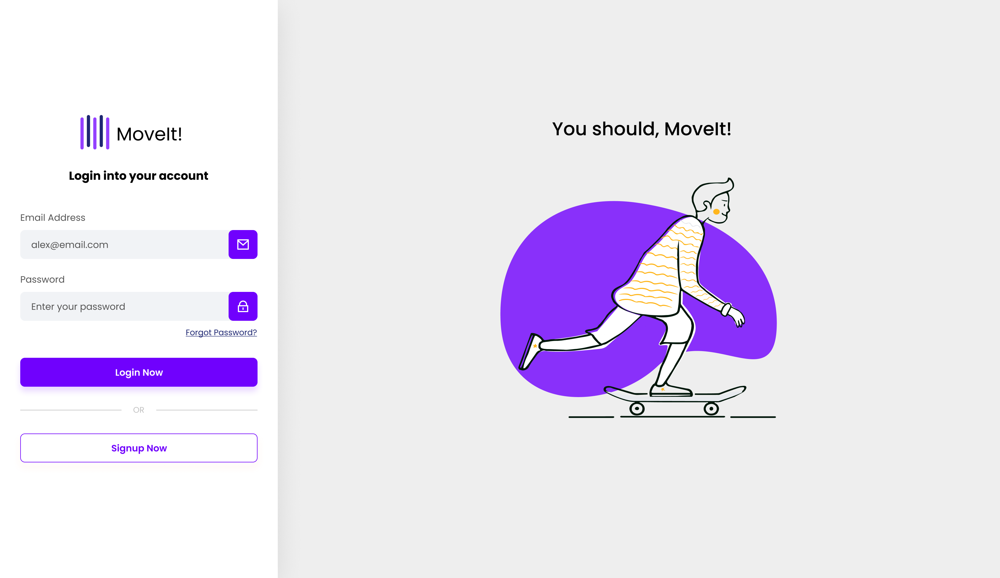

[TYPESCRIPT__BADGE]: https://img.shields.io/badge/typescript-D4FAFF?style=for-the-badge&logo=typescript
[ANGULAR__BADGE]: https://img.shields.io/badge/Angular-red?style=for-the-badge&logo=angular

<h1 align="center" style="font-weight: bold;">Login Page example in Angular 💻</h1>

![angular][ANGULAR__BADGE]
![typescript][TYPESCRIPT__BADGE]

<p align="center">
 <a href="#about">About</a> • 
 <a href="#started">Getting Started</a> • 
  <a href="#started">App Routes</a> • 
  <a href="#colab">Collaborators</a> •
 <a href="#contribute">Contribute</a>
</p>


<p align="center">
    
</p>

<h2 id="started">📌 About</h2>

This project is a simple Login and Sign Up app developed during [my youtube video](https://youtu.be/6qbuuPM_de4) to demonstrate how to create  Angular apps with authentication and integrate with backend.

<h2 id="started">🚀 Getting started</h2>

Here you describe how to run your project locally

<h3>Prerequisites</h3>

Here you list all prerequisites necessary for running your project. For example:

- [NodeJS](https://github.com/)
- [Git 2](https://github.com)
- [Angular CLI](https://angular.io/cli)

<h3>Cloning</h3>

How to clone your project

```bash
git clone https://github.com/Fernanda-Kipper/login-page.git
```

<h3>Starting</h3>

How to start your project

```bash
cd project-name
npm run start
```

<h2 id="routes">📍 Application Routes</h2>

Here you can list the main routes of your API, and what are their expected request bodies.
​
| route               | description                                          
|----------------------|-----------------------------------------------------
| <kbd>/signup</kbd>     | Page to sign up
| <kbd>/login</kbd>     | Page to login
| <kbd>/user</kbd>     | Protected page that only logged in users can access

<h2 id="contribute">📫 Contribute</h2>

1. `git clone https://github.com/Fernanda-Kipper/text-editor.git`
2. `git checkout -b feature/NAME`
3. Follow commit patterns
4. Open a Pull Request explaining the problem solved or feature made, if exists, append screenshot of visual modifications and wait for the review!

<h3>Documentations that might help</h3>

[📝 How to create a Pull Request](https://www.atlassian.com/br/git/tutorials/making-a-pull-request)

[💾 Commit pattern](https://gist.github.com/joshbuchea/6f47e86d2510bce28f8e7f42ae84c716)